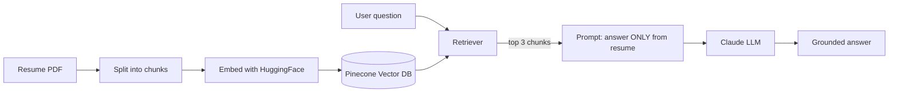

# 🤖 Resume RAG Chatbot + LLM Evaluation

An AI chatbot that answers questions about my resume using **RAG (Retrieval-Augmented Generation)** — and a built-in **LLM-as-a-judge evaluation suite** that grades its own answers for correctness.

Built to answer **only** from the resume (it politely refuses off-topic questions), and to *prove* its quality with measurable evaluation scores instead of guessing.


> 🔗 **Live demo:** [ragbot-eval.streamlit.app](https://ragbot-eval.streamlit.app)

---

## ✨ Features

- **Resume-grounded answers** — uses RAG so the bot only answers from the actual resume, not from the model's general knowledge.
- **Off-topic guardrail** — if a question isn't about the resume, the bot replies with a fixed refusal line instead of making things up.
- **Production vector database** — embeddings are stored and searched in **Pinecone** (serverless).
- **LLM evaluation suite** — a separate `evaluate.py` scores the bot's answers against a golden dataset using **DeepEval's G-Eval** (LLM-as-a-judge), printing a correctness score and the *reason* for each score.
- **Clean chat UI** — built with Streamlit, with chat history.

---

## 🧱 Tech Stack

| Layer | Technology |
|---|---|
| **Orchestration** | LangChain (`RetrievalQA`) |
| **Vector Database** | Pinecone (serverless) |
| **Embeddings** | HuggingFace `sentence-transformers/all-MiniLM-L6-v2` (384-dim) |
| **LLM** | Anthropic Claude (`claude-sonnet-4-6`) |
| **Evaluation** | DeepEval (G-Eval / LLM-as-a-judge) |
| **Frontend** | Streamlit |
| **Language** | Python |

---

## 🏗️ How It Works



**RAG flow:** the resume is split into chunks, embedded into numbers, and stored in Pinecone. When a question comes in, the retriever finds the 3 most relevant chunks, stuffs them into a guardrail prompt, and Claude writes an answer grounded only in those chunks.

**Evaluation flow:** `evaluate.py` runs a set of test questions through the bot, then a second Claude model (the "judge") scores each answer against the correct answer using DeepEval's G-Eval metric.

---

## 📂 Project Structure

```
resume-rag-eval/
├── app.py              # Streamlit chat UI
├── rag_utility.py      # RAG engine: build_qa_chain() + ask()
├── evaluate.py         # DeepEval LLM-as-a-judge evaluation suite
├── requirements.txt    # Dependencies
├── Resume.pdf          # The resume the bot answers from
├── .streamlit/
│   └── secrets.toml    # API keys (gitignored)
└── README.md
```

---

## 🚀 Getting Started

### 1. Prerequisites
- Python 3.12
- An [Anthropic API key](https://console.anthropic.com)
- A [Pinecone API key](https://www.pinecone.io) (free tier works)

### 2. Clone & install
```bash
git clone https://github.com/rebinnajeeb/resume-rag-eval.git
cd resume-rag-eval

python -m venv .venv
# Windows
.venv\Scripts\activate
# macOS/Linux
source .venv/bin/activate

pip install -r requirements.txt
```

### 3. Add your API keys
Create a file `.streamlit/secrets.toml`:
```toml
ANTHROPIC_API_KEY = "sk-ant-your-real-key"
PINECONE_API_KEY  = "pcsk_your-real-key"
```
> ⚠️ Keep this file private — it's in `.gitignore` so your keys never get pushed to GitHub.

### 4. Run the chatbot
```bash
streamlit run app.py
```
On first run, the app creates the Pinecone index and uploads the resume chunks automatically.

---

## 🧪 Evaluation (the interesting part)

Most RAG demos can't tell you *how good* their answers are. This one can.

`evaluate.py` uses a **golden dataset** (questions + correct answers) and **DeepEval's G-Eval** metric — an LLM-as-a-judge powered by Claude — to score each answer for correctness on a 0.0–1.0 scale, and explains *why* it gave each score.

```bash
python evaluate.py
```

**Sample output:**
```
Q:      What is the current job role?
RAG:    QA Automation Engineer at Cognizant Technology Solutions.
Score:  0.95  (pass >= 0.5)
Reason: The actual output matches the expected role and employer exactly.
----------------------------------------------------------------------
⭐ Average correctness: 0.93 / 1.00
```

This brings a **QA / software-testing mindset to AI** — treating LLM answers as something you measure and validate, not just hope are correct.

---

## ☁️ Deployment (Streamlit Community Cloud)

1. Push the repo to GitHub.
2. On [share.streamlit.io](https://share.streamlit.io), deploy the repo and pick **Python 3.12** in *Advanced settings*.
3. Add `ANTHROPIC_API_KEY` and `PINECONE_API_KEY` in the app's **Secrets**.

---

## 📌 Highlights

- End-to-end RAG pipeline: ingestion → embedding → vector search → grounded generation.
- Real production vector DB (Pinecone), not just an in-memory store.
- Quantitative LLM evaluation with DeepEval (G-Eval, golden dataset, LLM-as-a-judge).
- Guardrails so the assistant stays on-topic and avoids hallucinating.

---

## 👤 Author

**Muhammed Rebin Najeeb** — QA Automation Engineer transitioning into AI / GenAI Engineering.

- GitHub: [@rebinnajeeb](https://github.com/rebinnajeeb)
- LinkedIn: [rebin-najeeb](https://linkedin.com/in/rebin-najeeb)
- Email: rebinnajeeb2@gmail.com

---

## 📄 License

Released under the MIT License — feel free to learn from or build on it.
